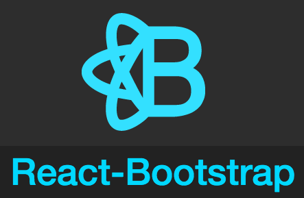
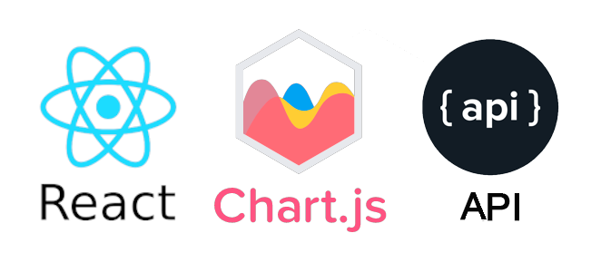
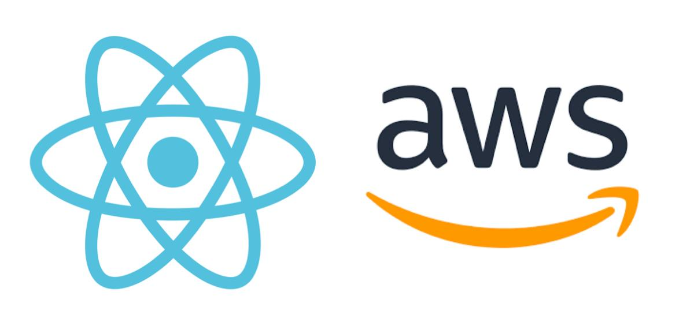

# Prueba Técnica API Frontend para Equipzilla
***

***
## Repositorio en el que se a estado trabajando el proyecto. 
## https://github.com/RobertoGuzman64/equipzillafrontend.git

## La aplicación se encuentra desplegada en AWS en el siguiente enlace: [https://master.dsuwckp3iftx9.amplifyapp.com/ ](https://master.d1tynjpf3j12n1.amplifyapp.com/)
<br>

## Pre-requisitos del proyecto para hacerlo funcionar en tu equipo local:

* Instalar **Nodejs** en nuestro equipo, descargándolo de su página oficial
https://nodejs.org/

* Clonar el proyecto en nuestro equipo con git bash:
```
git clone 'url-del-repositorio'
```

* Instalar todas las dependecias con el siguiente comando:
```
npm install
```

* Arrancamos el servidor con el siguiente comando:
```
npm start
```

## Tecnologías utilizadas en el proyecto:

* **react**: Instalamos react en nuestro proyecto:
```
npm install react
```
* **react-router-dom**: Instalamos react-router-dom en nuestro proyecto, para poder alternar entre vistas en nuestra aplicación:
```
npm install react-router-dom
```
* **axios**: Instalamos axios en nuestro proyecto, para poder hacer consultas a la API:
```
npm install axios
```
* **react-boostrap**: Instalamos react-boostrap en nuestro proyecto (Librería de componentes de Boostrap):
```
npm install react-boostrap
```
* **react-chartjs-2**: Instalamos react-chartjs-2 en nuestro proyecto (Librería de componentes de Chart.js):
```
npm install react-chartjs-2
```
* **react-tagcloud**: Instalamos react-tagcloud en nuestro proyecto (Librería de componentes de Tagcloud):
```
npm install react-tagcloud
```
***

***
***

***
***

***

## Explicación de la estructura del proyecto

El directorio **src** es donde está almacenada toda la aplicación. En este directorio se encuentra lo siguiente:

* **index.js**: Este es el archivo principal. Desde aquí se llama a **<App/>**, que es donde se ejecutará toda la aplicación.

* **app.js**: En este archivo es donde se gestionan los diferentes **Containers** de la aplicación (vistas).

* **Containers**: En este directorio es donde se guardarán las diferentes vistas:
    * **Twitter**: En esta vista tenemos la primera toma de contacto con la aplicación en donde se encuentran la tabla, la nube de tags y la gráfica de tweets.
* **Components**: En este directorio es donde se guardan todos los componentes que se usarán en todas las vistas:
    * **Grafica**: En este componente se encuentra la gráfica de cantidad de amigos y seguidores de los Usuarios de los tweets.
    * **NubeTags**: En este componente se encuentra la nube de tags con los nombres de Usuarios de los tweets de la aplicación.
    * **Tabla**: En este componente se muestran los datos de los tweets de la aplicación.
* **img**: En este directorio se guardan todas las imágenes que se usan para la aplicación y para el readme.
***

***